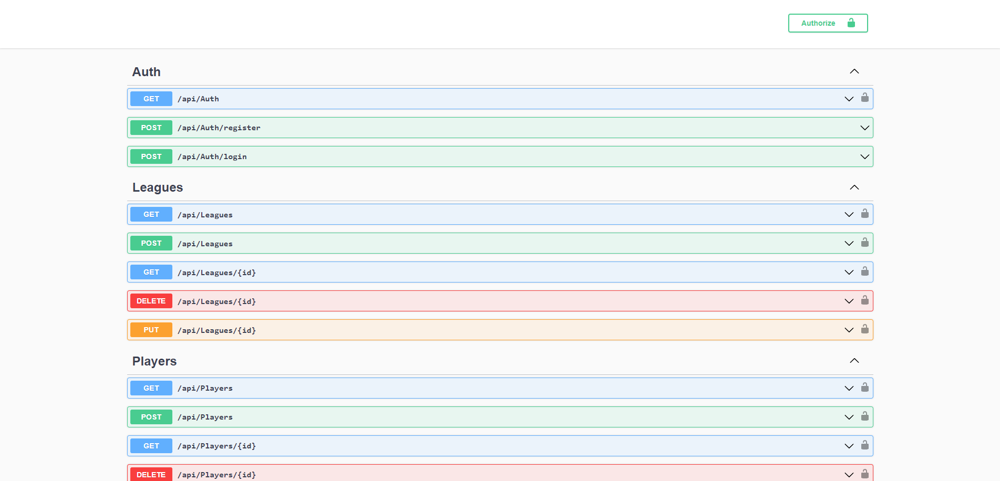

#  PremierApi

<h2>Project Overview:</h2>

PremierApi is a web-based REST API developed using C# and ASP.NET Core, designed to seamlessly integrate with a database housing an extensive array of Premier Football League statistics encompassing player details, team information, and league insights. This API allows clients to perform a wide range of essential operations by providing flexibility and efficiency , including data creation, retrieval, modification, and deletion. PremierApi also incorporates authentication functionality, enabling user registration and login capabilities. Once users are authenticated, they are issued a JSON Web Token, granting them access to initiate HTTP requests to the database. Moreover, an authorization mechanism is enforced to restrict unauthorized users from accessing sensitive information.

  

  
  
